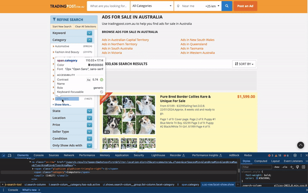

### Trading Post Web Scraper


The web scraper uses Selenium and a cron job is set up to run every 24 hours. 
The program writes into an Excel file with two sheets:

- Categories (category, number of items)
- Items (name, price, and url) from the items scraped in the starting page


The query selectors are found using inspect element, and copying it as CSS Selectors or using the class name as shown below.

<p align="center">
    
</p>

The cron job is set up as below to run every 24 hours:

```
crontab -e
0 0 * * * [/path/to/](run_script.sh)
```

The result of the scrape can be found in the [excel file](excel/data.xlsx).